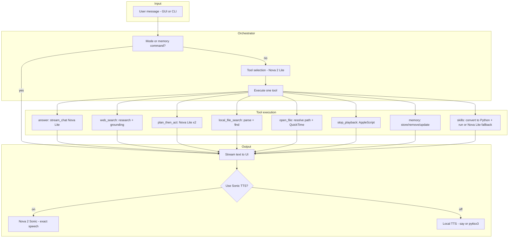

# Nova Speech-to-Speech Assistant

**A hackathon project built on AWS Nova: one assistant that talks, searches, remembers, and controls your machine.**

---

## Why This Project

We built a **single conversational agent** that uses **multiple AWS Nova models in the right places**: fast, cheap routing and intent with **Nova 2 Lite**; rich, natural voice with **Nova 2 Sonic**. The result is an assistant that can answer questions, search the web, search and play your local music, remember your preferences, load Claude Code skills, and speak back to you—either with local TTS or with Sonic for exact, high-quality speech. Everything is one turn: you say or type one message, the orchestrator picks the right tool, runs it, and streams the answer (and optionally speaks it).

**Highlights for the jury**

- **Multi-model design**: Nova 2 Lite for routing, intent parsing, summarization, web grounding, and chat; Nova 2 Sonic for optional verbatim TTS. We use each model where it fits best (latency, cost, quality).
- **Orchestrator + tools**: A clear agent loop: **tool selection → execute tool → stream answer**. No hidden magic—every path (web search, file search, open/play, memory, skills) is explicit and debuggable.
- **Local + cloud**: Local file search (find/play MP3s, open files in QuickTime in the background), optional mic input, and optional Sonic TTS; web search and chat go through Nova with grounding when needed.
- **Memory and skills**: Stored user facts improve routing and file resolution; optional Claude Code skills can be searched and applied via Nova Lite in the same turn.
- **Open-source skills**: The app ships with **skill definitions (SKILL.md) and Python implementations** in the `skills/` tree—human-readable specs plus runnable code. When a skill has a `run.py` (or other entrypoint), we use it; otherwise we generate a minimal script from the spec and persist it so the skill stays auditable and reusable.
- **Ready to demo**: GUI (Tkinter) and CLI; optional “Sonic (exact)” checkbox to speak the exact reply with Nova 2 Sonic.

---

## Features

| Feature | Description |
|--------|-------------|
| **Conversational UI** | Chat-style GUI (Tkinter) or CLI; optional voice input (mic) and voice output (local or Sonic). |
| **Smart routing** | One Nova Lite call chooses: answer, web search, plan_then_act, local file search, open file, stop playback, memory (store/remove/update), or skills (search/load). |
| **Web search** | Nova Lite with `nova_grounding`; results cached 30 min. |
| **Local file search** | Search by filename and extension (e.g. MP3, Word, PDF); results shown in chat; “Open 1” / “Open 2” or “play the song X” to open. |
| **Playback** | Open audio/video in QuickTime (background, auto-play); stop playback (QuickTime, VLC, Music, Spotify) via AppleScript or process kill. |
| **Memory** | Store/remove/update user facts; used in tool selection, file search intent, and path resolution. |
| **Skills** | Search and load skills from `skills/`; each skill has a **SKILL.md** (open spec) and optional **Python** (`run.py` or `scripts/`). We run existing implementations when present; otherwise we generate a minimal script from the spec, persist it in the skill folder or `skills-python/`, and run with your task. Fallback to Nova Lite if generation or run fails. |
| **Dual TTS** | Local (macOS `say` / pyttsx3) with optional summarization, or **Sonic (exact)**: Nova 2 Sonic speaks the exact reply. |

---

## How to Run

```bash
# Setup
python3 -m venv .venv
source .venv/bin/activate   # or .venv\Scripts\activate on Windows
pip install -r requirements.txt

# Env (required for Nova and optional for Sonic TTS)
# Option 1: Copy .env.example to .env and add your key there
cp .env.example .env
# Then edit .env and add: NOVA_API_KEY=your-key

# Option 2: Export directly in your shell
export NOVA_API_KEY="your-key"

# GUI (default)
python main.py

# CLI (no Tkinter)
python main.py --cli

# CLI with Sonic TTS after each reply
python main.py --cli --speak
```

In the GUI, use the **“Sonic (exact)”** checkbox to speak the exact assistant reply with Nova 2 Sonic; unchecked, the app uses local TTS (with optional summarization).

---

## Architecture (Technical)

### Overview



- **Single-turn agent**: For each user message, we run one **tool-selection** step, then **one** tool execution, then stream the final text (and optionally speak it).
- **Two Nova models**:
  - **Nova 2 Lite** (`nova-2-lite-v1`): All text and routing—tool selection, intent parsing (file search, skills, memory), web search (with grounding), plan-then-answer, and chat. Chosen for low latency and cost on many small calls.
  - **Nova 2 Sonic** (`nova-2-sonic-v1`): Realtime WebSocket TTS only. Used when the user enables “Sonic (exact)” to speak the **exact** reply with no summarization.

### Orchestrator (`orchestrator.py`)

The orchestrator is the main agent loop:

1. **Mode / memory commands**  
   If the message is a mode switch or memory command (e.g. “remember that …”, “forget …”), handle it and return (no tool selection).

2. **Tool selection**  
   `select_tool(user_message, memory_context)` calls **Nova 2 Lite** with a fixed system prompt that describes all tools. The model returns a single word: `answer`, `web_search`, `plan_then_act`, `store_memory`, `remove_memory`, `update_memory`, `local_file_search`, `open_file`, `search_skills`, `load_skill`, or `stop_playback`.  
   `memory_context` is a short string of stored facts so the router can choose “open file” or “local file search” when the user says “play my favourite song” and we have a stored fact about that song.

3. **Execute one tool**  
   Depending on the choice:
   - **answer**  
     `stream_chat(...)` with Nova Lite (system: “You are Nova …”) → streamed text.
   - **web_search**  
     `research(query)` → Nova Lite with `system_tools=["nova_grounding"]`; result is returned (and cached). If grounding returns nothing, we fall back to a short Nova Lite answer.
   - **plan_then_act**  
     Two Nova Lite calls: first a short plan (low `reasoning_effort`), then an answer that uses the plan as context; answer is streamed.
   - **store_memory / remove_memory / update_memory**  
     Handled in `modes.py` (Nova Lite used for parsing and matching which memory to remove/update).
   - **local_file_search**  
     `_parse_file_search_intent(user_message)` uses Nova Lite to get `(query, extensions)` from the message (and memory); then `search_files(query, scope=home, extensions=...)` in `file_tools.py` runs a local `find` and returns paths. We stream a short summary and a numbered list (with a display-only marker so TTS only says “Local search mode”).
   - **open_file**  
     `resolve_open_target(user_message)` uses `last_search_results` and patterns (“open 2”, “play the song X”); if needed, `_resolve_path_using_memory_and_recent(...)` uses Nova Lite to pick a path from recent/search results. Then `open_file(path)` opens in QuickTime (background, auto-play) or default app.
   - **stop_playback**  
     AppleScript (and if needed `killall`) for QuickTime Player, VLC, Music, Spotify.
   - **search_skills / load_skill**  
     **search_skills**: `search_skills_tool` lists matching skills from `skills/`. **load_skill**: we resolve the skill’s folder and prefer an **existing Python entrypoint** (`run.py`, `main.py`, or `scripts/run.py`); if found, we run it with the task and stream stdout. If not, the skill’s SKILL.md is **converted into a minimal Python script** via Nova Lite, saved in the skill folder or under **`skills-python/<skill-slug>.py`**, and run with the task; stdout is streamed. If generation or execution fails, we fall back to stream_chat with the skill as context.

4. **Streaming**  
   For “answer”, “plan_then_act”, “load_skill”, and the web-search fallback, the orchestrator uses `stream_chat(...)` and **yields** chunks so the UI can show text as it arrives. Other tools yield one or more complete strings (e.g. search result list, “Opened: …”, memory confirmation).

So: **one** Lite call for routing, then **one** tool path that may call Lite again (and optionally Sonic only for TTS). No multi-step tool loops in a single turn.

### Skills: open-source definitions and Python

The **`skills/`** folder contains **open-source skill definitions** (one `SKILL.md` per skill) and, where provided, **Python implementations** (e.g. `run.py`, `scripts/*.py`). That gives you:

- **Auditable specs**: Each skill is documented in plain Markdown; no black box.
- **Runnable code**: Skills can ship with their own entrypoint (`run.py`, `main.py`, or `scripts/run.py`). The orchestrator prefers these **existing implementations**: it runs them with your task, installs deps from the script and from the skill’s `requirements.txt`, and only generates a new script when no entrypoint exists.
- **Generated fallback**: When a skill has no runnable entrypoint, Nova Lite generates a **minimal Python script** from the SKILL.md and the user’s task. The script is saved in the skill folder (`run.py`) or under `skills-python/`, so the next run reuses it. Dependencies are inferred and installed in the project venv before execution.
- **Reusable and forkable**: Anyone can read, edit, or add skills; implementations stay in the repo or in a single, clear place.

So: **open spec + optional open implementation**, with AI-generated code only when needed and then persisted for reuse.

### Skills → Python conversion (load_skill flow)

When you **load_skill** with a task (e.g. “use the PDF skill to merge doc1.pdf and doc2.pdf”):

1. **Existing implementation**: If the skill has a known entrypoint (`run.py`, `main.py`, or `scripts/run.py` / `scripts/main.py`) under its folder, we run that script with the task as `sys.argv[1]`, with cwd set to the skill root and deps from the script plus the skill’s `requirements.txt`. No generation.
2. **Reused generated script**: If the skill has a **`run.py`** in its folder (from a previous generation), we run it the same way. If the skill has no folder entrypoint but **`skills-python/<skill-slug>.py`** exists, we run that with the task.
3. **Generate then run**: If no script exists, the chosen skill’s SKILL.md content is sent to **Nova 2 Lite** with the user task. The model returns a **single, minimalistic Python script** that implements only the **main features** needed for the task.
4. The new script is **saved** in the skill folder as **`run.py`** (when the skill has a folder) or under **`skills-python/<skill-slug>.py`**. Dependencies are parsed from the script (and optionally from the skill’s `requirements.txt`) and installed in the project venv; then the script is executed with the task as `sys.argv[1]`.
5. If generation or execution fails, the orchestrator **falls back** to applying the skill via Nova Lite (stream_chat with skill as system context).

This keeps skills **open-source and auditable** (spec + optional hand-written or generated Python) while reusing Nova Lite only when a runnable script is missing.

### Tool selection (`tool_selection.py`)

- **Single Nova Lite call** with a system prompt that lists all tools and when to use each.
- Output is parsed to one of the allowed choices; fallback heuristics (e.g. “mp3” → `local_file_search`) if the model returns something unexpected.
- **Why Lite**: Tool selection is a small, fast task; Lite is sufficient and keeps latency and cost low.

### Where each Nova model is used

| Use case | Model | Why |
|----------|--------|-----|
| Tool selection | **Nova 2 Lite** | One short completion; speed and cost matter. |
| File search intent (query + extensions) | **Nova 2 Lite** | Short structured output (two lines). |
| Skill search/load intent | **Nova 2 Lite** | Short phrases. |
| Path resolution (which file to open) | **Nova 2 Lite** | Pick from a list given user message + memory. |
| Web search | **Nova 2 Lite** + `nova_grounding` | Grounding tool + one summarization call. |
| Plan-then-act | **Nova 2 Lite** (plan + answer) | Two small completions. |
| Memory store/remove/update | **Nova 2 Lite** (in `modes.py`) | Extract fact, match memory index. |
| Final answer / skill application | **Nova 2 Lite** (`stream_chat` or script gen) | Streaming text reply; or generate minimal Python from skill and run it. |
| **Skill → Python script** | **Nova 2 Lite** | One-off generation of minimal script from skill + task; script persisted in `skills-python/`. |
| Speech synthesis (exact reply) | **Nova 2 Sonic** (Realtime) | High-quality, verbatim TTS when “Sonic (exact)” is on. |

So: **Lite** for all reasoning, routing, and text; **Sonic** only for optional, exact-speech output.

### Supporting modules

- **`file_tools.py`**: Local file search (`find` + cache), open with QuickTime (background, auto-play), stop playback, resolve “Open 1” / “play the song X” using `last_search_results` and recent paths.
- **`research.py`**: Web search via Nova Lite + `nova_grounding`; response cached 30 min.
- **`modes.py`**: Memory load/save, store/remove/update with Nova Lite for parsing and selection.
- **`skills_tools.py`**: List and load skills (SKILL.md) from the `skills/` folder; resolve skill root and find entrypoints (`run.py`, `main.py`, `scripts/run.py`).
- **`skill_to_python.py`**: Prefer running an existing script in the skill folder; otherwise convert a skill’s content into a minimal Python script (Nova Lite), save it in the skill folder or under **`skills-python/<skill-slug>.py`**, install deps, and run with the user task.
- **`skills/`**: Open-source skill definitions (SKILL.md) and optional Python implementations per skill; see skill subfolders and `skills/skills/<name>/run.py` or `scripts/`.
- **`skills-python/`**: Persisted generated scripts when a skill has no folder entrypoint; see `skills-python/README.md`.
- **`speech_utils.py`**: Prep text for local TTS (strip markdown, optional Nova Lite summarization for long text).
- **`nova_client.py`**: OpenAI-compatible client for Nova (Lite chat/stream, Sonic Realtime WebSocket TTS).

---

## Why Multiple Nova Models

- **Nova 2 Lite** is used for every **text** task: routing, intent, grounding, summarization, and streaming answers. That keeps the agent responsive and cost-effective while still using memory and tools.
- **Nova 2 Sonic** is used only when we want **high-quality, exact speech** of the reply. By making Sonic optional and only for TTS, we get natural voice without slowing or complicating the main agent loop.

So: **many Lite calls, one Sonic usage path**—each model used where it adds the most value for the jury and the user.

---

## License

See [LICENSE](LICENSE).
